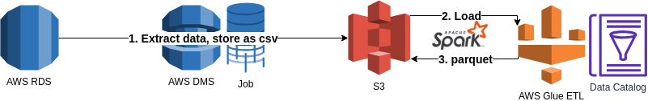

#  Example ETL job
Simple example ETL job for ingesting RDBMS tables into partitioned parquet on S3 via AWS DMS and AWS Glue. 
This can be used to build a serverless Data Warehouse on AWS.

All used ETL components are serverless or fully managed.

1. Load data via AWS DMS, cdc (change data capture) is enabled. Replication instance connects to DB and writes data to s3 in csv format.
2. A Glue Table for csv data on S3 will be used as source to load the csv data via a scala Spark glue ETL job. Bookmarking is enabled to avoid duplicated loads.
3. The example job writes snappy compressed, partitioned parquet to S3.

# Data Warehouse
AWS Athena can be used to query the new Glue Tables. Partitioned parquet is a good way to lower costs. The partitioning must match the queries to minimize scanned data.

AWS Athena, Glue Data Catalog, as well as Glue ETL and S3 are serverless. Therefore only the AWS DMS replication instance is not serverless but fully managed by AWS.

